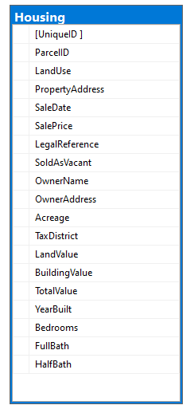

# Data Cleaning using MS SQL SERVER

This is a short practice project for SQL using MS SQL server.

Covers some commonly used data cleaning methods ranging from Beginner to Intermediate SQL querries.

## Dataset

Using `NashvilleHousing` dataset

## How to run

1- Extract `create_db_nashville_housing.zip`

2- Run `create_db_nashville_housing.sql` to create database `Nashville` with table name `Housing`

3- Load SQL code sql_query_1.sql to run cleaning data

## Cleaning data detail

- TASK 1: Standardize date format
- TASK 2: Formatting Property Address
- TASK 3: Segregating Address parts(address,city,state)
- TASK 4: Cleaning 'SoldAsVacant' Col
- TASK 5: Remove Duplicates

## Function

- SQL DDL/DML (SELECT, UPDATE, DELETE, ALTER)
- CONVERT, ISNULL, IS NULL, JOIN
- SUBSTRING, CHARINDEX, LEN
- PARSENAME, REPLACE
- CASE WHEN, CTE (WITH AS), ROW_NUMBER
