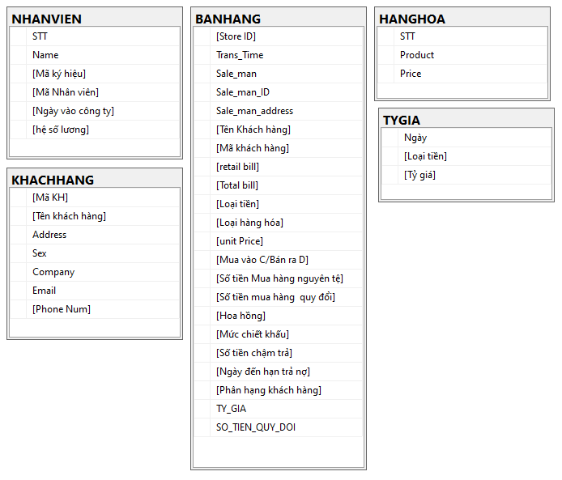

# THỰC HÀNH SQL TRÊN **`MS SQL SERVER`**

## CẤU TRÚC CÁC BẢNG TRONG CƠ SỞ DỮ LIỆU [QLBH]

## NỘI DUNG THỰC HÀNH

### 1. create_db_qlbh.sql

Tập lệnh SQL dùng để tạo cơ sở dữ liệu [QLBH]

### 2. query_basic.sql

- TASK 1: SELECT, UPDATE
- TASK 2: SELECT INTO, ALTER TABLE, UPDATE
- TASK 3: CREATE TABLE, INSERT INTO, DELETE, TRUNCATE
- TASK 4: CREATE TABLE, INSERT INTO, UPDATE

### 3. query_intermediate.sql

- TASK 1: ALTER TABLE, UPDATE
- TASK 2: ALTER TABLE, UPDATE, ROW_NUMBER()
- TASK 3: CREATE PROCEDURE WITH PARAMETERS
