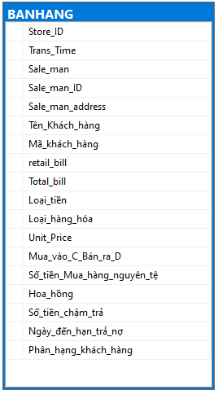

# THỰC HÀNH SQL TRÊN **`MS SQL SERVER`**

## CẤU TRÚC CÁC BẢNG TRONG CƠ SỞ DỮ LIỆU [QLDS]

## NỘI DUNG THỰC HÀNH

### 1. create_db_qlds.sql

Tập lệnh SQL dùng để tạo cơ sở dữ liệu [QLDS]

### 2. query_advance.sql

- TASK 1: CREATE PROCEDURE
- TASK 2: SCALAR FUNCTION
- TASK 3: TABLE-VALUED FUNCTION
- TASK 4: Trigger time execute Procedure
