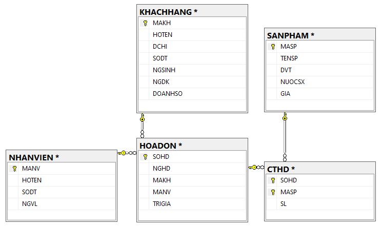

# THỰC HÀNH SQL TRÊN **`MS SQL SERVER`**

## CẤU TRÚC CÁC BẢNG TRONG CƠ SỞ DỮ LIỆU [QLHD]

## NỘI DUNG THỰC HÀNH

### 1. create_db_qlhd.sql

Tập lệnh SQL dùng để tạo cơ sở dữ liệu [QLHD]

### 2. query_basic.sql

- TASK 1: SELECT
- TASK 2: SELECT, NESTED QUERY, ALTER TABLE, UPDATE, SELECT INTO
- TASK 3: UNION ALL

### 3. query_intermediate.sql

- TASK 1: JOIN
- TASK 2: ALTER TABLE, UPDATE, SUM, CONVERT
- TASK 3: WITH AS, ROW_NUMBER()

### 4. query_advanced_1.sql

- TASK 1: Create Procedure get sales by day
- TASK 2: Create Procedure get sales by CustomerID and month
- TASK 3: Create Procedure get Commision for Employee
- TASK 4: Create Procedure get top 3 product ...

### 5. query_advanced_2.sql

- TASK 1: Scalar Function
- TASK 2: Table Function, Procedure with IF ELSE
- TASK 3: Scalar Function with IF ELSE
- TASK 4: Table Function with CASE WHEN
- TASK 5: WHILE, CURSOR

### 6. query_advanced_3.sql

- TASK 1: Table Function, Procedure
- TASK 2: Scalar Function, Procedure, WHILE / CASE WHEN
- TASK 3: Create Procedure with ROW_NUMBER(), WHILE

### 7. query_advanced_4.sql

- TASK 1: Trigger Insert, Update, Delete
- TASK 2: Create Trigger Print notify

### 8. query_advanced_5.sql

- TASK 1: EXEC(@SQL)
- TASK 2. PIVOT TABLE
- TASK 3. UNPIVOT
